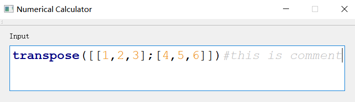

# 测试报告


## 单元测试

本部分测试类的正确性以及相关函数的正确性。

### polynomial 类测试


### matrix 类测试


## 恢复测试

本部分测试异常处理与错误输入的处理。

### 错误的函数名

```python
WrongFunctionName([1,2,3])
```

效果：


### 非法的字符

```python
invert([[1,2];[3,4]]非法字符)
```

效果：


### 括号不匹配

```python
[1,2] * [[1,2,3];[4,5,6]
```

效果：


### 其他错误的表达式的情形

```python
SolvePoly(x^2+x=)
```

效果：


### 


## 功能测试

本部分验证软件的功能完备性。

### 语法高亮

```python
transpose([[1,2,3];[4,5,6]])#this is comment
```

效果：




### 曲线绘制

```python
draw(x^2)
```

效果：


```python
draw(x^0.5)
```

效果：


```python
draw(0.5x)
```

效果：


### 矩阵计算行列式

```python
ComputeDeterminant([[1,2];[3,4]])
```

效果：


### 一次方程求解

```python
SolvePoly(x + 1 = 0)
```

效果：


### 二次方程求解

```python
SolvePoly(x^2 - x = 0)
```

效果：


### 高阶方程求数值解

```pyhton
SolvePoly(x^3+x+1)
```

效果：


### 多项式函数积分

```python
integrate(x^2+x)
```

效果：


### 矩阵的加法

```python
[[1,2];[3,4]] + [[7,6];[3,4]]
```

效果：


### 矩阵的减法

```python
[[1,2];[3,4]] - [[7,6];[3,4]]
```

效果：


### 矩阵的乘法

```python
[[1,2];[3,4]] * [[7,6];[3,4]]
```

效果：


### 矩阵的求逆

```python
invert([[1,2];[3,4]])
```

效果：


### 矩阵的转置

```python
transpose([[1,2];[3,4]])
```

效果：


### 线性方程组的求解

```pyhton
SolveLinear([[2,1,3];[1,-1,1]]) #传入的是线性方程组对应的增广矩阵
```

效果：


